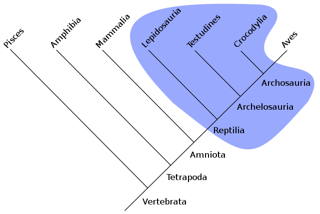
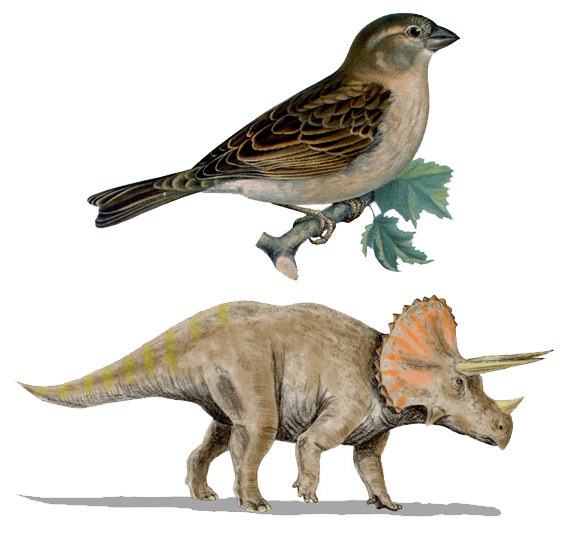
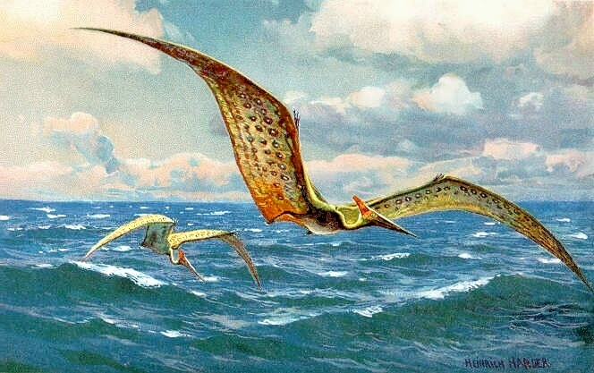
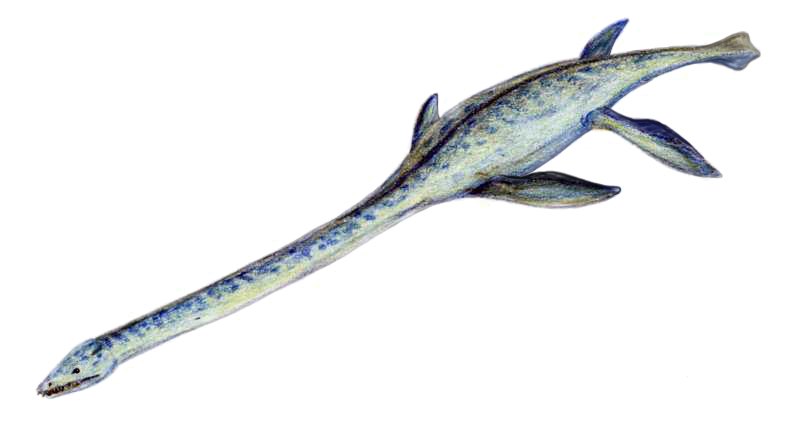

# sfi_presentation_20210601

My SFI presentation of 2021-06-01 about dinosaurs

## Dinosaurier

Dinosaurier var djur, som levde i Mesozoikum.
Dinosaurier var inte reptiler, det är bättre
som säga dom är medlem från Archosauria,
en systerart von reptiler.

Måsta dinosaurier dog ut sextiosex miljon år sedan,
men utan den föräldar von fåglarna.

Alla dinosaurier var landdjur.
Det är fel att tänker det dinosaurier
flyggada (utan dina föräldar von fåglarna) 
och simmade. Till exempel, pterosauria, 
med bekännte medlem Pterodactylus var en reptil.

Här visar jag en Elasmosaurus.
Hen var tretton meter lång
och levde i vatten.
Också den var inte en dinosaurier, men en reptil.

