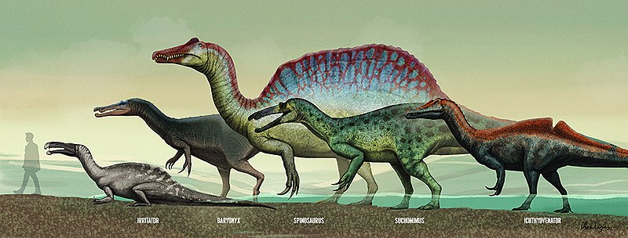
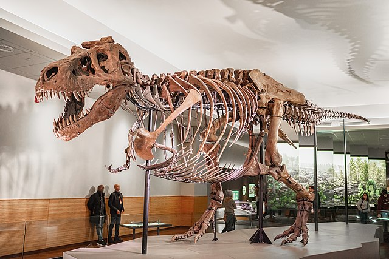
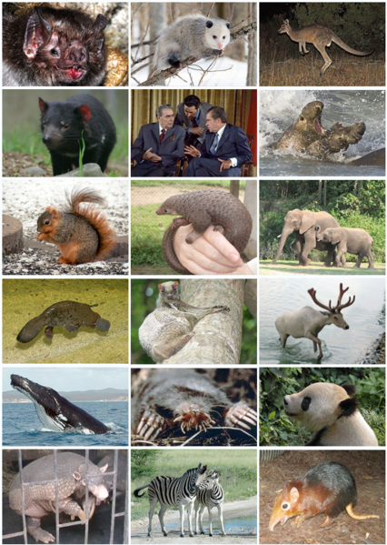

# sfi_presentation_20210601

My 'Swedish For Internations' (SFI) 
presentation of 2021-06-01 about dinosaurs.

## Dinosaurier

Dinosaurie betyder fruktansvärt ('dino') reptil ('saurier').
Det är rätt, för att dinosaurier var stor, hade många tänder 
och många äter kött. 
Den bästa exempel är Tyrannosaurus Rex.
Här är Sue, hon var tretton meter lång och var fyra meter högt:

Dinosaurier var djur, som levde i Mesozoikum.
Dinosaurier var inte reptiler, det är bättre 
som säga dom är medlem från Archosauria,
en systerart von reptiler.

Måsta dinosaurier dog ut sextiosex miljon år sedan,
men utan den föräldar von fåglarna och krokodiller.
Forskare tänker det dinosaurier dog ut
för en jätteasteroid ramlade till jord.

Alla dinosaurier var landdjur.
Det är fel att tänker det dinosaurier
flyggada (utan dina föräldar von fåglarna) 
och simmade. Till exempel, pterosauria, 
med bekänntesta medlem Pterodactylus var en reptil.

Här visar jag en Elasmosaurus.
Hen var tretton meter lång
och levde i vatten.
Också den var inte en dinosaurier, men en reptil.

Kanske det är inte rolikt det dinosaurier är inte här,
för att dinosaurier är jättebra. Men när dinosaurier var
bort, var tid riktikt för däggdjur ('Mammalia').
Och däggdjur det är oss!

